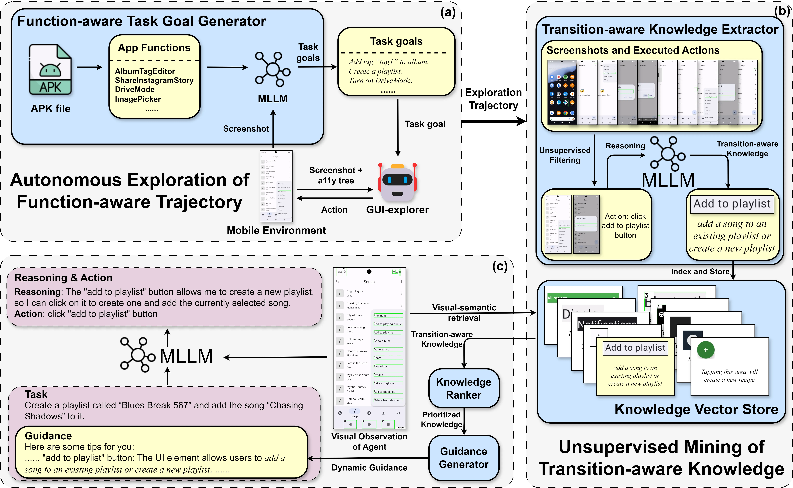
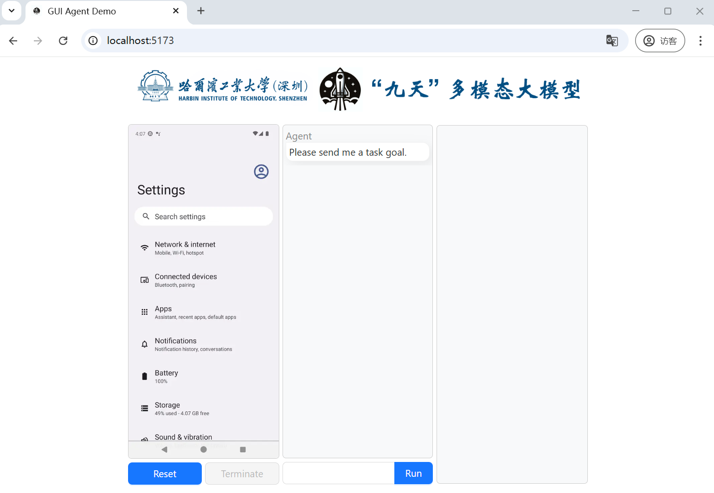
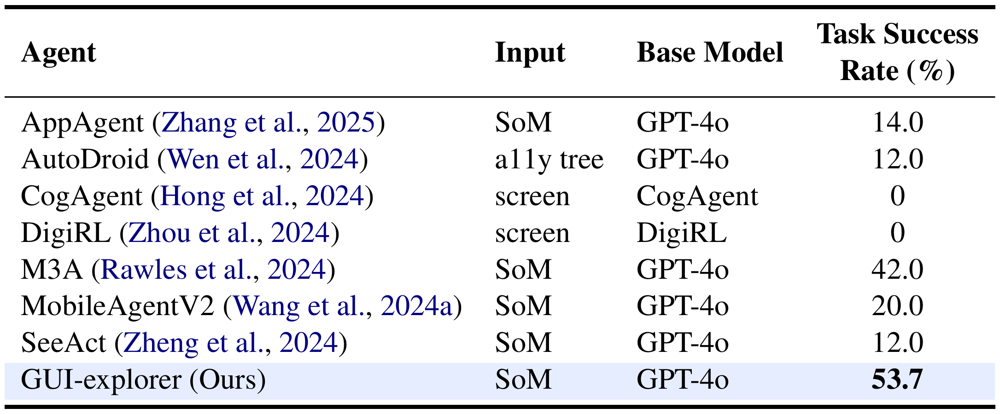
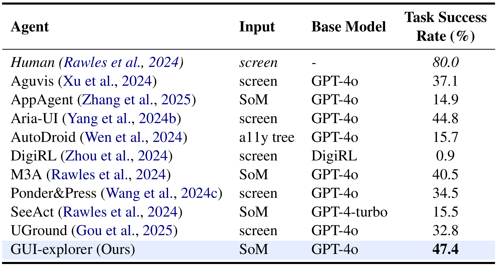
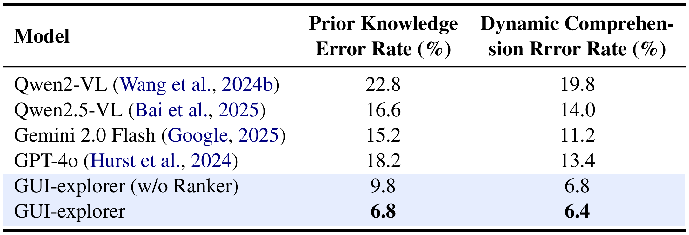
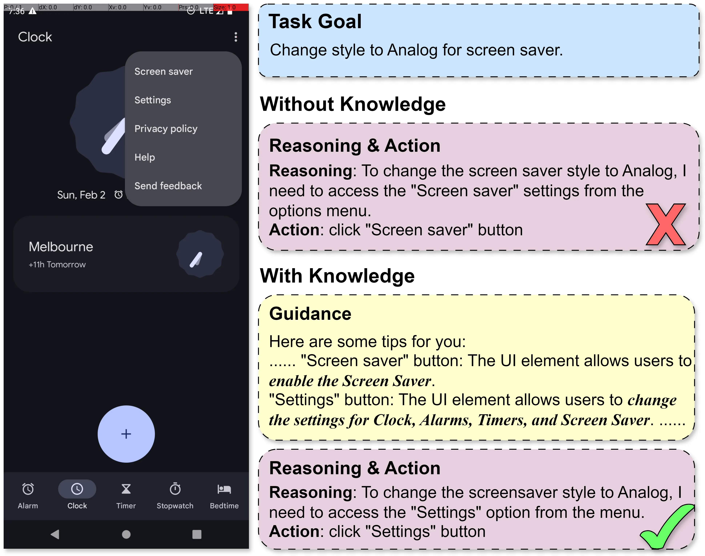

<div align="center">
<!-- <h1>JiuTian (九天) </h1> -->

<h2 class="papername">GUI-explorer: Autonomous Exploration and Mining of Transition-aware Knowledge for GUI Agent</h2>
<div>
<div>
    <a href="https://xieincz.github.io/" target="_blank">Bin Xie<sup>1</sup></a>,
    <a href="https://rshaojimmy.github.io/" target="_blank">Rui Shao<sup>1*</sup></a>,
    <a href="https://scholar.google.com/citations?user=Mpg0w3cAAAAJ" target="_blank">Gongwei Chen<sup>1*</sup></a>,
    <a href="https://jnhujnhu.github.io/" target="_blank">Kaiwen Zhou<sup>2</sup></a>,
    <a href="https://yinchuanll.github.io/" target="_blank">Yinchuan Li<sup>2</sup></a>,
    <a href="https://faculty.hitsz.edu.cn/liujie" target="_blank">Jie Liu<sup>1</sup></a>,
    <a href="https://zhangmin-nlp-ai.github.io/" target="_blank">Min Zhang<sup>1</sup></a>,
    <a href="https://liqiangnie.github.io/" target="_blank">Liqiang Nie<sup>1</sup></a>
</div>

<sup>1</sup>Harbin Institute of Technology, Shenzhen, <sup>2</sup>Huawei Noah’s Ark Lab<br>
<sup>*</sup>Corresponding author

Annual Meeting of the Association for Computational Linguistics (**ACL**) 2025

[[Paper]](https://arxiv.org/abs/2505.16827) [[Code]](https://github.com/JiuTian-VL/GUI-explorer) [[Project Page]](https://xieincz.github.io/GUI-explorer.github.io/) 

:fire: Details will be released. Stay tuned :beers: :+1: 

</div>
</div>

## If you find this work useful for your research, please kindly cite our paper and star our repo.

## Updates

- [05/2025] [Project Page](https://xieincz.github.io/GUI-explorer.github.io/) released.
- [05/2025] [Arxiv paper](https://arxiv.org/abs/2505.16827) released.
- [05/2025] [Code](https://github.com/JiuTian-VL/GUI-explorer) released.

## Introduction

This is the github repository of *GUI-explorer: Autonomous Exploration and Mining of Transition-aware Knowledge for GUI Agent*. In this work, we propose GUI-explorer. It synergizes two key components: (1) Autonomous Exploration of Function-Aware Trajectory; (2) Unsupervised Mining of Transition-Aware Knowledge.

The overview of the proposed GUI-explorer:

<div align="center">

</div>

## Installation

### Download

```bash
git clone https://github.com/JiuTian-VL/GUI-explorer.git
cd GUI-explorer
mkdir knowledge_base
cd knowledge_base
wget https://github.com/JiuTian-VL/GUI-explorer/releases/download/knowledge_base/knowledge_data.pkl
```

### Environment

```bash
cd GUI-explorer
conda create -n GUI_explorer python=3.12 -y
conda activate GUI_explorer
pip install torch torchvision torchaudio --index-url https://download.pytorch.org/whl/cu126
pip install -r requirements.txt
```

Duplicate `.env.example` and rename it to `.env`. Then, in the `.env` file, fill in your `OPENAI_API_KEY`.

## Usage

### Prepare api servers

```bash
# Open a new shell window and run
cd GUI-explorer
conda activate GUI_explorer
python -m utils.embedding_pipeline

# Open a new shell window and run (Need to wait for embedding_pipeline to start up)
cd GUI-explorer
conda activate GUI_explorer
python -m utils.retrieval 
```

#### Exploration

```bash
# After prepare api servers
cd GUI-explorer
conda activate GUI_explorer
python exploration_and_mining.py -device_serial emulator-5554 -max_branching_factor 10 -max_exploration_steps 30 -max_exploration_depth 5 -package_name net.osmand
# After the update of knowledge_base, you need to restart `python -m utils.retrieval` to load the new knowledge_base
```

`device_serial` can be obtained by running `adb devices`. (If not, you need to follow the `Setup` section in [this tutorial](https://github.com/ai-agents-2030/SPA-Bench/blob/main/Documentation.md#setup)).

`package_name` can be obtained from the app's link on the app store. For example, in `https://play.google.com/store/apps/details?id=net.osmand`, `net.osmand` is the `package_name` for this app.

#### Demo

```bash
# After prepare api servers
# Connect an Android device to this computer and make sure you can see it in `adb devices`.
# Open a new shell window and run
cd GUI-explorer
conda activate GUI_explorer
python -m demo.demo_web_backend

# Open a new shell window and run
cd GUI-explorer
conda activate GUI_explorer
python -m demo.demo_agent_backend

# Open a new shell window and run
cd GUI-explorer/demo/demo_web_frontend
pnpm install
pnpm run dev
```

Open http://localhost:5173 in your browser.

You should be able to see something like this:




## Evaluation Results

Table 1: Main Result of GUI-explorer on SPA-Bench single-app English Level 3 tasks. 


Table 2: Main Result of GUI-explorer on AndroidWorld tasks. 


Table 3: Main Result of GUI-explorer on GUI-KRB. 



## Showcases

|                         Instruction                          |                            Video                             |
| :----------------------------------------------------------: | :----------------------------------------------------------: |
| Open Google Chrome and search for today's weather in Shenzhen. Carefully observe the screen and record the current weather conditions. Then, in Markor, create a note named "today.md" and write the temperature read from the webpage into it. | <video src="https://github.com/user-attachments/assets/d8fb64fc-862c-4ef3-af3a-dc86543bfb13" height="788" /> |
| Get the search results for stay tonight near 'wembley stadium' for 1 adult. Add one result to wishlist. Confirm that this item is in the wishlist. | <video src="https://github.com/user-attachments/assets/9dbae8ca-ceb1-4472-b908-f7de6df71189" height="788" /> |


## More Examples




## Citation

If you find this work useful for your research, please kindly cite our paper:
```
@inproceedings{xie2025gui,
    title={GUI-explorer: Autonomous Exploration and Mining of Transition-aware Knowledge for GUI Agent}, 
    author={Bin Xie and Rui Shao and Gongwei Chen and Kaiwen Zhou and Yinchuan Li and Jie Liu and Min Zhang and Liqiang Nie},
    booktitle={Annual Meeting of the Association for Computational Linguistics (ACL)},
    year={2025}
}
```
